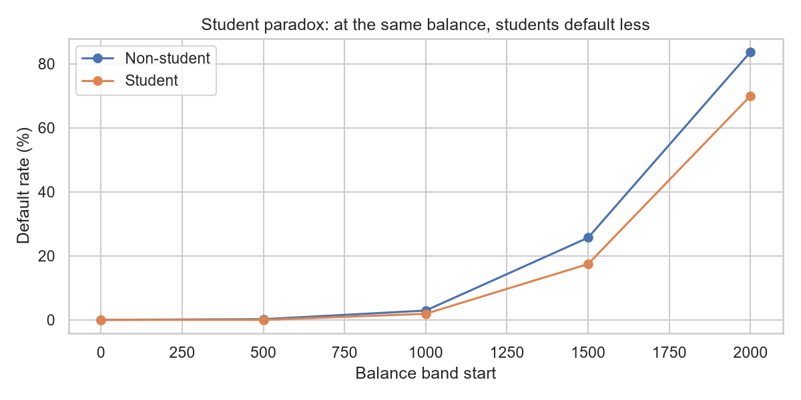
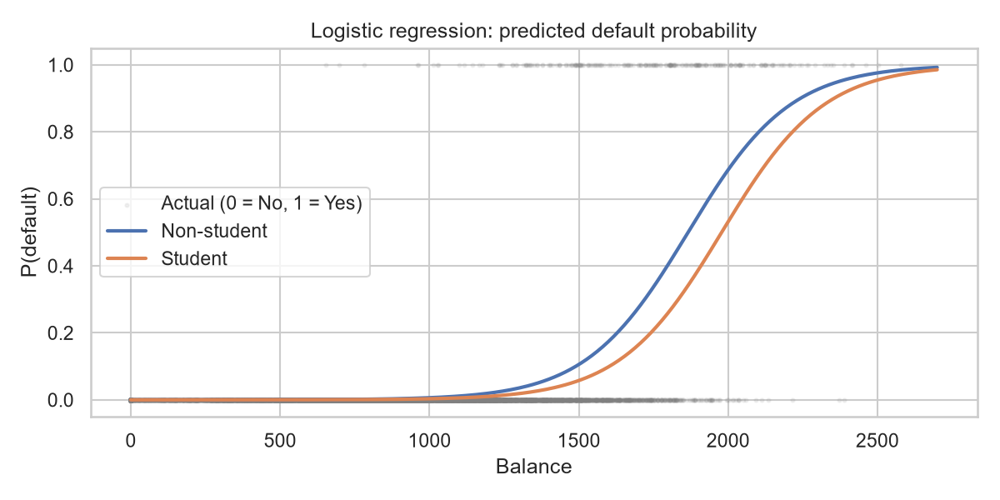
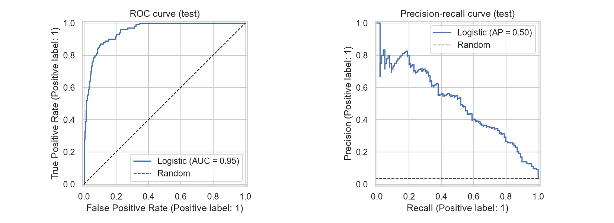
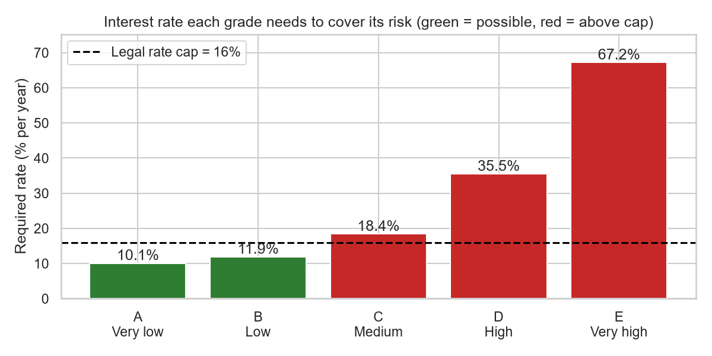

# Credit Card Default – Insights, Risk Model and Tariff Table

Which credit card customers will not pay their debt, why, and what should a bank do about it?
This project answers these questions with **Python and SQL (DuckDB)** on the ISLR `Default` dataset (10,000 simulated customers).

`Default.xlsx` → **01 Cleaning** → **02 EDA** → **03 Model** → **04 Tariff table & recommendations**

**Tools:** Python (pandas, statsmodels, scikit-learn, seaborn) · SQL (DuckDB) · Jupyter notebooks.
Every notebook has a short English/Thai guide, and every chart has a "How to read" note, so non-technical readers can follow it.

## Key findings

1. **Only 3.3% of customers default** (333 of 10,000). A model that always says "No" is 96.7% accurate but catches nobody, so the model is judged by recall and AUC, not accuracy.
2. **Balance drives default.** Every extra 100 of balance multiplies the odds of default by **1.79**. Risk jumps from almost zero to very high between a balance of about 1,100 and 2,000.
3. **Student paradox.** Students look riskier overall, but at the same balance their odds of default are **48% lower**. They only look riskier because they carry higher balances.
4. **Income does not matter** (p = 0.86), so it is not in the model.
5. **The model works on new customers.** Logistic regression with `balance` + `is_student` has a test **AUC of 0.951** (0.5 = guessing, 1 = perfect). At a cutoff of 0.3 it catches **53 of 100** defaulters (33 at the usual 0.5 cutoff).
6. **Risk is concentrated.** The riskiest 10% of customers hold 80% of all defaulters. Grades D–E are only **5.3%** of customers but hold **62%** of defaulters and **72%** of the expected loss.
7. **Price cannot fix the riskiest grades.** Grades D and E would need 35.5% and 67.2% interest, far above Thailand's 16% credit card cap. The bank should manage them with credit limits, early reminders and payment plans instead.

## Tariff table

Results for the 3,000 test customers the model never saw during training.

| Grade | Chance of default | Customers | Rate needed | Rate offered (max 16%) | Action |
|---|---|---:|---:|---:|---|
| A – Very low | < 1% | 2,156 | 10.1% | 10.1% | Lower rate; can offer limit increase |
| B – Low | 1–5% | 467 | 11.9% | 11.9% | Risk-based rate; keep standard limit |
| C – Medium | 5–20% | 219 | 18.4% | 16.0% | Charge the cap; no limit increase; monitor monthly |
| D – High | 20–50% | 108 | 35.5% | 16.0% | Freeze limit; early reminder; offer payment plan |
| E – Very high | 50%+ | 50 | 67.2% | 16.0% | Block new spending; collections or restructuring |

**Rate needed** = cost of funds (3%) + operating cost (4%) + expected loss (chance of default × 80% of the balance lost) + target margin (3%).
These money numbers are **example assumptions** – change them in `04_tariff_recommendation.ipynb`.
The full table, with actions in Thai too, is in [outputs/tariff_table.csv](outputs/tariff_table.csv).

## Charts

| Student paradox | Chance of default by balance |
|---|---|
|  |  |
| **Model quality (AUC 0.95)** | **Rate needed vs the 16% cap** |
|  |  |

All 14 charts are in [outputs/figures/](outputs/figures/).

## Data

ISLR `Default` dataset from *An Introduction to Statistical Learning* ([statlearning.com](https://www.statlearning.com/)). See [Data description.txt](Data%20description.txt).

| Raw column → clean column | Meaning |
|---|---|
| `rownames` → `customer_id` | Customer ID |
| `default` → `default_flag` | **Target** – did the customer default? Yes/No → 1/0 |
| `student` → `is_student` | Is the customer a student? Yes/No → 1/0 |
| `balance` | Average card balance left after the monthly payment |
| `income` | Customer income |

**Data quality:** all 6 checks pass (no missing values, no duplicates, only Yes/No categories, no negative numbers).
31 customers have unusually high balances (26 of them defaulted), and 499 have a balance of 0 (none defaulted).
Both are real groups, so no rows were removed.

## Project structure

```
├── Default.xlsx                    raw data (10,000 customers)
├── Data description.txt            column definitions
├── 01_cleaning.ipynb / .py         data checks → clean table
├── 02_eda.ipynb / .py              exploration, charts 01–07
├── 03_modeling.ipynb               model and evaluation, charts 08–11
├── 04_tariff_recommendation.ipynb  risk grades, tariff table, charts 12–14
├── sql/                            all SQL, one file per step
│   ├── 01_cleaning.sql
│   ├── 02_eda.sql
│   ├── 03_modeling.sql
│   └── 04_tariff.sql
├── sql_utils.py                    loads the named queries from the .sql files
├── data/
│   ├── default_clean.csv           clean data (made by step 01)
│   └── default.duckdb              DuckDB database (made by 01_cleaning.py, not in git)
├── outputs/
│   ├── figures/                    14 charts (PNG)
│   └── tariff_table.csv            tariff table (English + Thai actions)
└── requirements.txt
```

## How to run

Tested with Python 3.14.

```powershell
python -m venv .venv
.venv\Scripts\Activate.ps1          # Windows PowerShell
# source .venv/bin/activate         # macOS / Linux
pip install -r requirements.txt
```

**Option A – notebooks (full project):** open the folder in VS Code or Jupyter, choose the `.venv` kernel, and run the notebooks in order: `01` → `02` → `03` → `04`.
Open them from the project folder, because they look for `data/` and `sql/` in the current folder.

**Option B – scripts (steps 01–02 only):**

```powershell
python 01_cleaning.py   # checks the raw data, saves data/default_clean.csv and data/default.duckdb
python 02_eda.py        # prints the EDA tables, saves charts 01–07
```

## How the SQL is organised

All queries live in `sql/`, one file per step. Each query starts with a name line:

```sql
-- name: default_rate_by_balance_band
SELECT ...
```

`sql_utils.load_queries()` splits a file into `{name: query}`.
In the notebooks, `run("query_name")` shows the SQL and returns the result as a table.
Some queries take values from Python, such as `$threshold` (the cutoff) or `$lgd` (the share of the balance lost).

## Method

1. **Cleaning** – 6 data checks in SQL, then build `default_clean` (rename columns, Yes/No → 1/0).
2. **EDA** – default rate by balance band, students vs non-students at the same balance, correlations.
3. **Modeling** – 70/30 train/test split (stratified, seed 42) → "always No" baseline → logistic regression in `statsmodels` to read the coefficients → 8 models compared with 10-fold cross-validation → cutoff chosen on the training data → final check on the test set.
4. **Tariff** – score the test customers, give each a grade A–E, work out the rate each grade needs, and turn it into actions.

## Limitations

- The data is **simulated** and has only 3 predictors. Real credit models also use payment history, credit limit, age and more.
- There is no time information, so balance is **linked** to default – we cannot say it **causes** it.
- The best cutoff and the tariff depend on the bank's real costs, which this data does not include.

## สรุปภาษาไทย

- ข้อมูลลูกค้าบัตรเครดิต 10,000 คน ผิดนัดชำระหนี้แค่ **3.3%**
- **ยอดหนี้** สำคัญที่สุด: ยอดหนี้เพิ่มทุก 100 โอกาส (odds) ผิดนัดเพิ่ม **1.79 เท่า** ส่วน **รายได้ไม่มีผล**
- นักศึกษาดูเสี่ยงกว่าในภาพรวม แต่ที่ยอดหนี้เท่ากัน odds ผิดนัด **ต่ำกว่า 48%** (Simpson's paradox)
- โมเดล logistic regression มี **AUC 0.951** ที่เกณฑ์ 0.3 จับคนผิดนัดได้ **53 จาก 100** คน
- ลูกค้าเกรด D–E มีแค่ **5.3%** แต่มีคนผิดนัด **62%** และต้องใช้ดอกเบี้ยเกินเพดาน 16% มาก → ควรคุมด้วย **วงเงิน** การแจ้งเตือน และแผนผ่อนชำระ ไม่ใช่ขึ้นดอกเบี้ย
- วิธีรัน: ติดตั้งแพ็กเกจจาก `requirements.txt` แล้วรัน notebook ตามลำดับ `01` → `02` → `03` → `04`
